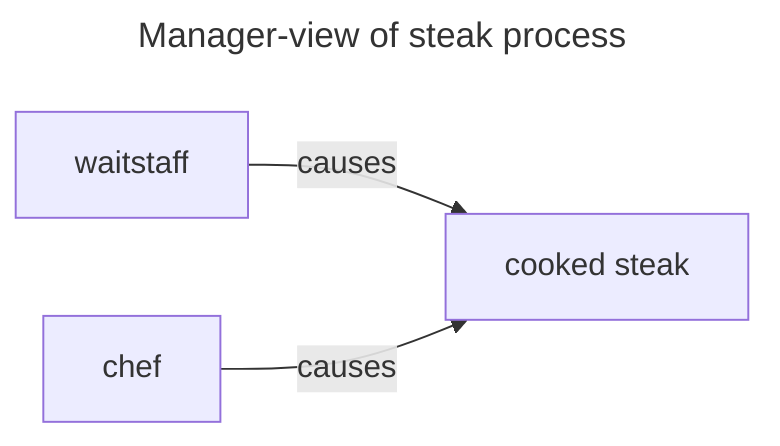
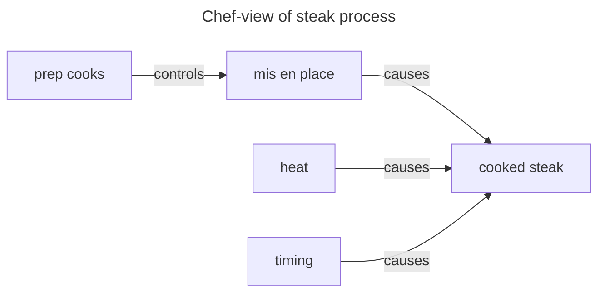
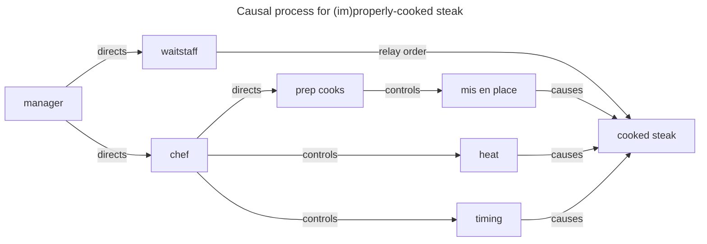

**Scenario:** 

A local steakhouse is getting a complaint for not cooking a steak to the customer's satisfaction, and they want to take action to improve.

"If my steak is overcooked, the cause is the manager not properly running their restaurant and the only way to fix it is to tell that to the manager." 

Customer complains to manager, comes back next week and the steak is cooked perfectly --> talking to the manager fixed the steak. 

"I don't cook the steaks; if my customers aren't happy with their food, and the waitstaff got the order correct, then the only way I can cause an improvement is tell the chef they need to pay attention to the food."

Manager lectures the chef after the complaint, next week there are no complaints --> intervening with the chef fixed the steak

"I keep telling the prep cooks to slice the steaks to a consistent thickness, otherwise they dry out in the time it takes this weak stove to properly cook them to the proper internal temperature, which is limited to the time before the servers want to take the plates out."

Chef fired one of the prep cooks, got a sous-vide setup, now marinates and par-cooks the steaks to cut down the time to fire each order --> changing the approach to heating the steaks fixed the problem

**The full picture**

None of these perspectives are incorrect, or contradictory. A 'relevant' causal factor depends on what interventions are being evaluated. In fact, all the combined domain perspectives for this process can be encoded into a single graph.

**Is it cause-and-effect?**

If the outcome following the change to the heating process improves, relative to a comparable scenario that was getting different results, we call that a causal effect from the intervention, and it was large enough to matter in a practical sense. Causal ML models permit this same measurement based on data from dozens of kitchens, controlling for differences except for isolating their heating process, without having to start a controlled experiment and wait for the results.

Does the manager need to understand the causal effect of heat on a steak? It would be useful domain knowledge, but statistically, it is not necessary, and practically it is not necessary for their role. If 'heat' is just some factor that is neither the outcome nor the proposed intervention, then it is not required; `chef --> steak` describes a valid causal path that can be measured and acted upon.

**Is a statistical cause a 'true' cause?**

Would it matter if the waitstaff were the "true cause" of this issue by trying to take out plates in an unrealistic amount of time, so they maximize their tips for good service? Statistically, no. It doesn't change how much the intervention on heating caused an effect. 

If someone were looking at the waitstaff as a target for intervention, then this same style of analysis could be run to look for the effects of those interventions. If nobody is planning to take action of the waitstaff, it would be academic anyway. And it wouldn't change the fact that the other interventions taken caused a change in the outcome.

Further, if the waitstaff were like this in every kitchen/every time period in the data, it would be statistically impossible to say what difference could be made with an intervention via the waitstaff. Someone would have to come up with a novel plan for intervention, implement it, and then look at the results (ie conduct an experiment, due to lack of observational data). 

Statistical methods can help understand observations of existing processes, but it requires relevant data to be available, and for sufficient domain knowledge to effectively put that data to work on the question of interest. A statistical causal effect is 'true' because domain knowledge says it is true (unless further domain knowledge challenges that assertion).

**Could it be something else?**

Could the customer's overcooked steak be caused by something else? Sure, anything you can imagine based on domain knowledge. 

Could the steak be 'overcooked' because it is dry without a sauce/gravy? If adding sauce to a steak is followed by reduced complaints, with all known factors accounted for (and if complaints would persist without the sauce), then it would be statistically valid to say sauce fixes overcooked steaks as a causal effect. (Domain knowledge suggests that we re-state that as "sauce causes dry steaks not to draw complaints" after the fact)

Taking a step back, really the desired outcome is reduced customer complaints (which might be a proxy for increased customer satisfaction). Maybe complaints are caused by price too? If reducing the prices reduced the number of complaints (and increased prices reliably increased complaints), that would be a valid causal effect.

That's the statistical perspective, which is intrisically linked to the data-gathering process, and the contextual inferences made within the domain. 

**From a practical perspective, a 'cause' is only a cause if we expect we can change it to yield a difference to the outcome. Causal statistical analysis provides insight on how we could expect that intention to translate to the outcome.**
