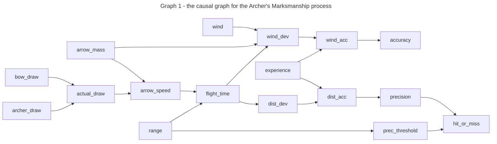

# Simulated Causal process 

Goal: design a non-trivial process to generate data suitable for testing methods of recovering the causal effects

## Plain-language design:

- process modelled around archery marksmanship 
- outcomes are based on external deterministic factors (physics), individual deterministic factors (stats), and some random variation
- disclaimer: I know next to nothing about archery
- disclaimer: physics will be a guide, but simplified and the numbers rounded to make them suit my personal preferences

### Output values
- distance of actual-landed from exact-target location as a target-variable for regression
- binary label of whether or not the actual-landed location is within a given distance to constitute a 'bull's-eye' as a target-variable for discrete classification

### Visible/Direct Input factors
- range from archer to target in metres
- ideal draw-weight of bow in Newtons
- draw-strength of archer in Newtons
- mass of arrow in grams
- wind in metres per second
- experience (proxy for baseline random deviation) 
- bull's-eye threshold

### Hidden/Underlying model 
- constant assumed draw length 0.75m
- accuracy threshold:
    - 4cm at 20m
    - 8cm at 40m
    - 12cm 60+m
    -> 2cm accuracy per 10m range for bull's eye

### Derived/Interaction factors
- actual draw = min(archer, bow)
- arrow speed m/s = sqrt(actual_draw N * 0.75m / arrow_mass g *0.001)
- flight time s = range m / arrow_speed m/s
- wind deviation increases for longer flight time, increases w higher wind speed, scaled by aerodynamic constant, reduced with higher arrow mass
- wind deviation m = flight_time s * wind_speed (m/s) * 0.10 * (40 g / arrow_mass g)
- distance deviation = flight_time s * 20 cm
- expected error: Normal(0, deviation * correction cm)
- experience correction factor: 
    - expert: scale corrected deviation by 0.8
    - competent: scale corrected deviation by 1.0
    - beginner: scale corrected deviation by 1.5

### Score intuition check
- shooting 50m @100m/s -> deviation to correct = 10cm
- bull's eye accuracy @50m = 10cm
- Normal(0, 10*0.8) will be within 10cm for ~79% of the time for expert

- shooting 30m @85m/s -> 7cm correction
- bull's eye accuracy @30m = 6cm
- Normal(0, 7*1.0) within 6cm ~60% of the time for competent

- shooting 20m @75m/s -> 5cm correction
- bull's eye accuracy @20m = 4cm
- Normal(0, 5*1.5 ) within 4cm ~40% of the time for beginner

### Baseline scenario and ranges: 
- range 30m (20m - 90m)
- bow draw 267N (175N - 350N)
- archer draw 300N (175N - 400N)
- arrow mass 25g (20g - 35g)
- arrow speed 90m/s (75m/s - 110m/s)
- wind 1m/s (0m/s - 5.5m/s)
- experience: competent (beginner-competent-expert)

## Causal graph visualized



## Implementation to simulate data 

```julia
using Random, Distributions

success_rate = 1 - cdf(Normal(0, deviation * correction), -acc_threshold) * 2

```

```julia
# implement rules & logic

DRAW_LEN = 0.75; # 0.75m draw length
AERO_COEF = 0.10 * 40; # deviation of 10% of wind for 40g arrow
DIST_COEF = 20;

actual_draw(archer, bow) = min(archer, bow);
arrow_speed(draw, mass) = sqrt(draw * DRAW_LEN * 1000 / mass);
flight_time(range, speed) = (range / speed);
wind_deviation(wind, time, mass) = wind * time * AERO_COEF / mass;
dist_deviation(time) = time * DIST_COEF;
corrected_deviation(dev, skill_value) = rand(Normal(0, dev * skill_value)); 
check_bound(range, dev) = dev <= (2 * range/10);
```

```julia
# set parameters for a simulation

# Archer parameters 
bow_draw_lim = 175:25:350;
archer_draw_lim = 175:400;
experience = Dict(
    :novice => 1.5, 
    :intermediate => 1.0, 
    :expert => 0.8
);

# Shot parameters
range_lim = 20:10:90;
arrow_mass_lim = 20:3:35;
wind = Exponential(1.5);
```

```julia
# generate simulated data set

n_archers = 1000;
n_shots = 100; 

struct Archer
    exp_level::Symbol
    strength::Int
    bow_draw::Int
end

struct Shot
    range::Int
    arrow_mass::Int
    wind::Number
end


gen_archer()::Archer = Archer(
    rand(keys(experience)), 
    rand(archer_draw_lim),
    rand(bow_draw_lim)
)

gen_shot()::Shot = Shot(
    rand(range_lim),
    rand(arrow_mass_lim), 
    round(rand(wind), digits=1)
)

function shoot(a::Archer, s::Shot) 
    ft = flight_time(s.range, arrow_speed(actual_draw(a.strength, a.bow_draw), s.arrow_mass)) 
    d_dev = corrected_deviation(dist_deviation(ft), experience[a.exp_level]) 
    w_dev = corrected_deviation(wind_deviation(s.wind, ft, s.arrow_mass), experience[a.exp_level]) 
    return (
        skill = a.exp_level, 
        strength = a.strength, 
        bow = a.bow_draw, 
        range = s.range, 
        arrow = s.arrow_mass, 
        wind = s.wind, 
        precision = round(sqrt((d_dev ^ 2) + (w_dev ^ 2)), digits=4), 
        score = check_bound(s.range, sqrt((d_dev ^ 2) + (w_dev ^ 2))) 
    )
end
```

```julia
arch = gen_archer()
shot = gen_shot() 
record = shoot(arch, shot)
```

```julia
using DataFrames, DuckDB 

archers = [gen_archer() for i in 1:n_archers]
shots = [gen_shot() for i in 1:n_shots]
records = []; sizehint!(records, n_archers*10)
for a in archers
    for s in rand(shots, 10)
        push!(records, shoot(a, s))
    end
end 
df = DataFrame(records)
```

```julia
db = DuckDB.open("__local_artifacts__/portable.duckdb")
con = DuckDB.connect(db)con = DBInterface.connect(DuckDB.DB, ) 

# query the database
results = DBInterface.execute(con, "create table archery as from df")

```