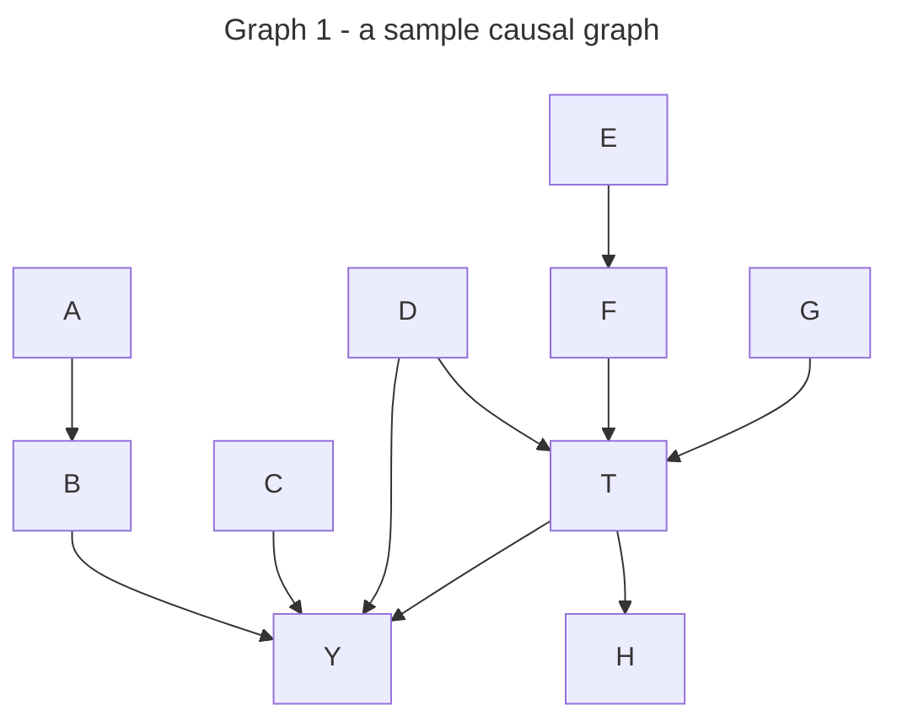
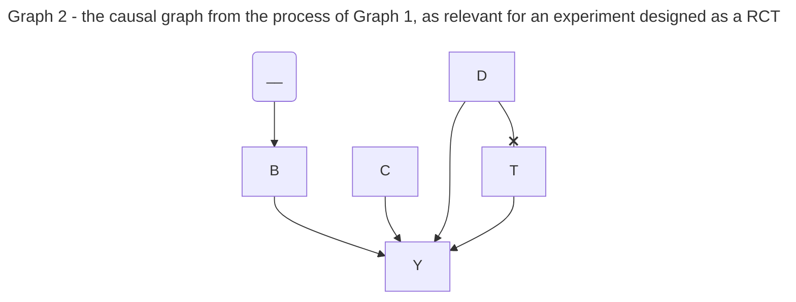
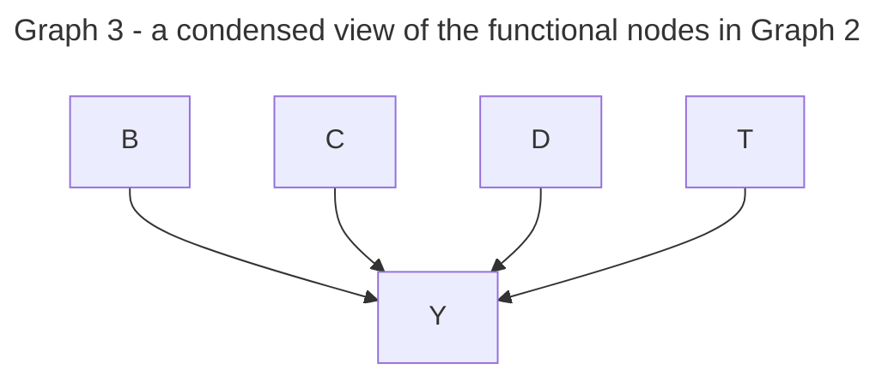
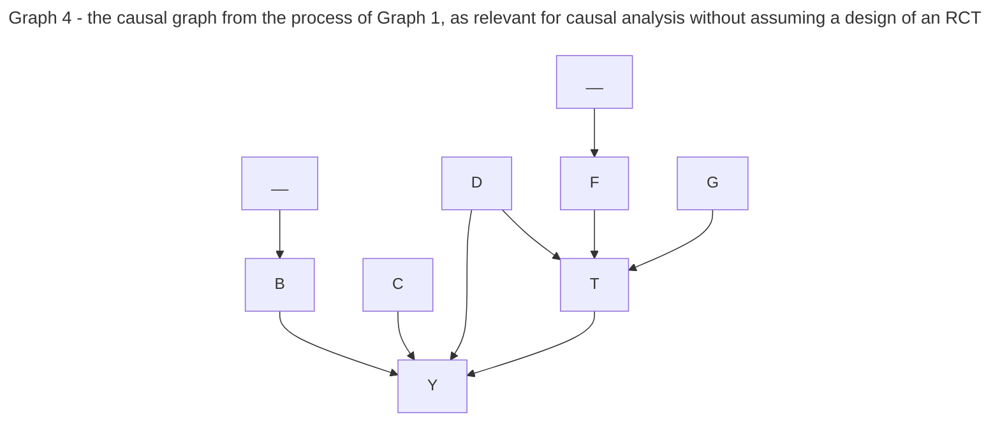
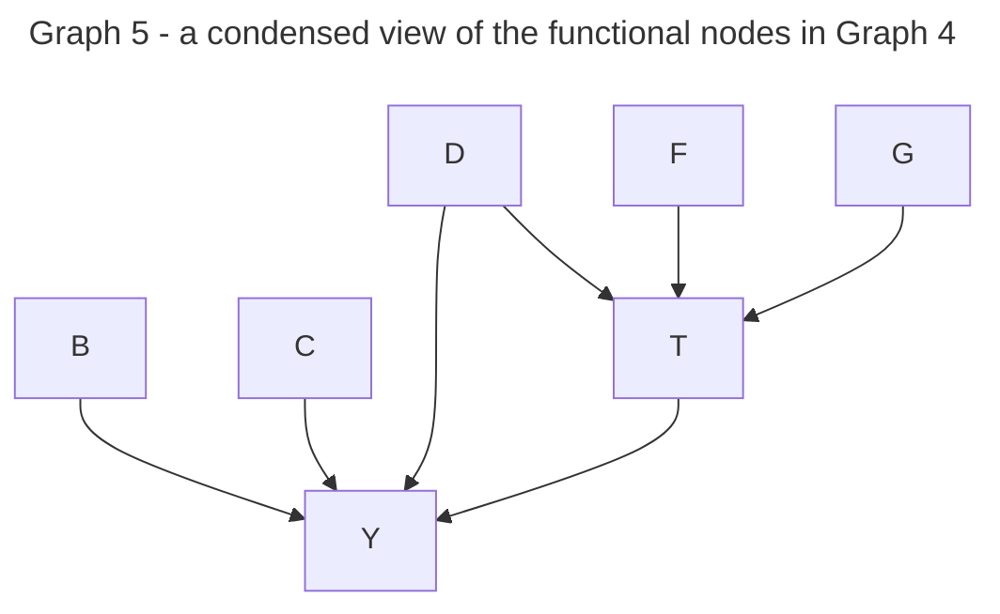
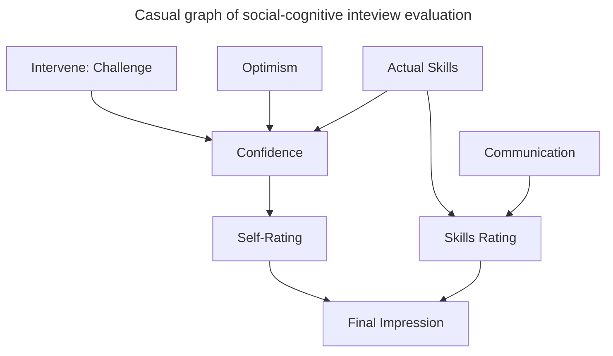
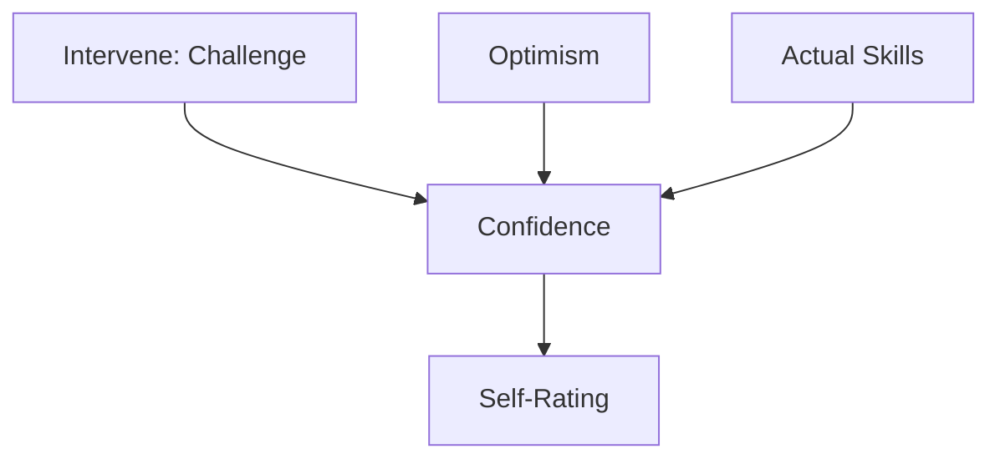

# Vector Institute Lab - Causal Inference via Machine Learning

Revision 0 - 2023-06 Thomas Vandrus 

***** 
# Contents
[https://www.markdownguide.org/hacks/#table-of-contents]: #

- [Foundation](#assumed-background) 
    - [Sample Causal Graph](#sample-causal-graph) 
    - [Discussion](#discussion) 
- [Formal Concepts](#formal-concepts-for-causal-inference) 
- [Technical Solutions](#technical-solutions) 
    - [Naive Inverse-Propensity Weighting](#simple-inverse-propensity-weighting) 
    - [Double-ML Framework](#double-ml-framework)
***** 

## Assumed Background

* the value of a causal vs correlational relationship in data 
* basic principles of statistical experimental design (controlling covariates, isolating/calculating effects)
* familiarity with the concept of statistical modelling (any of parametric/frequentist or non-parametric/empirical/computational methods)
* the concept of domain knowledge (non-statistical context that defines the meaning of statistical analyses)

## Terminology

**Causality**: an ordered link between two occurrences, where a theory of an underlying mechanism defines the direction. 

*Note: The theory of an underlying mechanism is usually defined by domain knowledge for the problem at hand* 

**Outcome (Y)**: an observable result from a process of interest

**Treatment/Intervention (T)**: an observable variable of interest, which is usually studied as having a causal relationship to the Outcome, in particular a variable that could be modified via intervention

**Causal Relationship**: specifies the causality between two nodes
    example: `A -> B` or "A causes B" or "A has a causal effect on B" or "A affects B" 

    Motivation for Causal Analyses (or "why are we doing a bunch of extra work before throwing a predictive model at it?")

    * Causality is not observable, it is a concept. One way to frame it is in terms of Counter-Factuals. If we knew that under one value of A, a particular value of B was expected, but that under a different value of A, the value of B is expected to be different, those values of B constitute the counter-factual data points. We can only observe one outcome from one scenario. The next-best thing is to statistically construct those parallel but comparable scenarios and estimate the difference.  

    * Experimentation is the scientific standard for testing a hypothesized Causal Relationship. The crux of experimentation is imposing controls on the circumstances/scenario that will yield an Outcome, which allows for the statistical isolation of the effect of the Treatment. The standard experimental design is the Randomized Controlled Trial (RCT).  When testing "A causes B", the procedure is to set A, and then measure B across the relevant domain/support, and RCT design comes with several benefits (meets assumptions needed for computationally-cheap, sample-efficient, intuitive statistical methods like ANOVA, simple linear regression).  

    * For analysis on observational data (empirical data gathered after the outcomes are known), a number of these conveniences must be considered explicitly in order to provide inferences to the same standard. Statistical learning/machine learning (ML) methods are available that are comparatively not as computationally-cheap, less sample-efficient to varying degrees, and/or less intuitive. With an abundance of data points and sufficient compute resources, there is an ample range of ML-centric methods that can provide the same quality of insights on causal hypotheses, so long as they are defined to meet the same core criteria. Extra work is needed to formalize these conditions. 

**Causal Graph**: a generalized format for incorporating all the causal relationships relating to the Outcome of a process. This is a graphical representation of the theory yielded by domain knowledge (graph = collection of nodes and edges). 

### **Sample Causal Graph**

    Note: the causal graph is always directed (direction of causality) and acyclic (nothing affects any factors that affect itself). Some examples of interpretations: 
        A affects B, and B affects the Outcome 
        A indirectly affects the Outcome via B
        C affects the Outcome directly
        Treatment affects the Outcome directly
        D affects the Outcome directly
        D affects the Treatment directly
        D affects the Outcome indirectly via the Treatment
        G affects the Treatment 
        G indirectly affects the Outcome via the Treatment
        H is affected by the Treatment, and does not affect the Outcome
        
*Note: Based on Domain Knowledge encoded in this graph, H is neither a cause nor effect of interest. H yields no information that is not dependent on any factors that aren't already being considered (T), so it can only provide zero noise, or non-zero noise. This is the formal reasoning why H can/should be excluded from modelling `T->Y`, even if it happens to be observed/provided in the data extract, and is related to the underlying process of interest.*

***VERY IMPORTANT NOTE:***
* the discussion of methods for inference/analysis assumes that a sufficient causal graph is generated from domain knowledge.
    * If a *causally-relevant** variable in the graph is not measurable in the data, the practitioner must decide how to handle that based on their discretion (proceed with a disclaimer, or declare the analysis infeasible/invalid, or seek a way to compensate)  
            **the formal definition is not intuitive*
    * If a causally-relevant variable is not in the causal graph, these methods will not identify it (though for lack of extensive domain knowledge, exploratory data analysis can aid the creation of the causal graph) 
    * If a non-relevant variable is included in the data for computation, then the computation method itself will determine how the inclusion of that noise might affect the analysis (some methods are quite robust against noise, others may suffer increased bias and/or variance, no methods benefit from irrelevant extra variables)

**Covariates (X)**: the collection of factors in the causal graph other than the Outcome and Treatment (example: A, B, C, D, E, F, G)

**Treatment Effect**: the difference attributed to a particular Treatment value when compared against the counterfactual Outcome from a different Treatment value  
    example: 1yr mortality outcome of a patient following a new treatment `T_1` compared to the counterfactual 1yr mortality outcome if that patient was given the control treatment `T_0` 
        formally: `causal effect of treatment = (Y_1) - (Y_0)`

**Causal Inference**: the procedure of estimating a causal effect statistically/quantifiably. 

*Note: To most accurately/precisely/reliably estimate this effect size for the factor of interest (generally an identified Treatment/Intervention) to compare between different values, the goal is to statistically exclude the noise/effects of the other non-interesting covariates.*  
* Commonly phrased as: "Isolate" the Treatment Effect when estimating by "controlling for" the other covariates 
* `Expected Treatment Effect = E(Y_1|T_1,X) - E(Y_0|T_0,X)` 
* Modelling `E(Y|T,X)` is a great task for ML to do empirically, especially if a large number of covariates, covariate-values, or treatment-values data points make it impractical to calculate that expectation directly

## Discussion

* Considering the above Casual Graph, with the default direction that we wish to establish the Causal Effect of T on Y
* We should obviously control for covariate F affecting Y when examining how T affects Y.  
* Similarly, it would be ideal to control for at least one of A and B. Depending on the model used, it may range from non-harmful to harmful to include both non-independent factors, but only one is required. (This may be intuitive, but including exactly one of those two variables satisfies a formal assumption for causal analysis.)  
* Since T is not just another covariate, we don't really want to throw it in the mix the same as all the others ... worst-case, a model with regularization might simply ignore it depending on noise from other sources. That would artificially estimate the effect to be non-existent, and we are starting with a justified assumption that T does affect the Outcome. 
* The direct effect of C on Y should be controlled for. But C indirectly affects Y via T, and following the example of indirect effects from A & B, it may be advantageous to only include one ... but removing T defeats the exercise, and removing C certainly means a biased estimate of Y. This confounding may require a different approach, or at least a model type that is robust against these non-independent factors.  
* The indirect effect of G on Y via T suggests it may not be necessary to include, since there isn't any debate about which to keep (T vs G). But if it is observable, and is stated to have an indirect effect on Y, maybe there is something useful that can be done with it.  
* How about D and E? Include both? Neither? One, or the other? (The standard predictive modelling approach is to throw it all in there and pick a model that is robust to noise, avoiding this conflict entirely.) 

***Motivation for a suitable model architecture:***

In a Randomized Controlled Trial (RCT), the design intentionally makes it such that P(T|X) is balanced for each value of T, independent across all values of X. This is very convenient mathematically, and fully avoids hazards from awkward data (see Simpson's paradox). 

In observational data, we generally have no control over the data that was generated. If there was any element of self-selection (ie some values of X were more likely to receive a certain treatment value), the data will often systematically unbalance itself. This alone is enough to invite issues for some popular models. 
So for observational data from which we attempt to draw causal inferences, we need to generalize for this phenomenon before we aggregate the data for our estimate. 

## Formal Concepts for Causal Inference 

Under certain assumed circumstances, ML can be deployed to compute a meaningful causal effect estimate
Consider these in the context of how a valid causal design like Random Controlled Trials satisfies them

1. Consistency: 
    * we can only observe one out of the multiple counterfactual outcomes for a given sample unit 
        * if we could manipulate and observe parallel universes, this topic of statistics is fully obsolete, and RCTs would be unnecessary
    * our observation of the outcome is reliable/verifiable according to our ground truth/gold standard/etc

2. Independent outcomes: 
    * the observed outcome of a unit does not depend on observed outcomes from other units 
    * RCT relies on this too

3. Exchangeability/Independence: 
    * to estimate a treatment-induced difference in outcomes, we need to compare two outcomes from two different units receiving two different Treatments, as simulated counterfactual outcomes of the same scenario 
    * we need a basis for why they are similar enough to act like counterfactuals; assume "they could have exchanged places and we would expect to observe the counterfactual outcomes" 
    * Intuitively: Knowing the treatment assigned to the patient should give us no information a priori about what the outcome looks like.
        * imagine an observational dataset examining the mortality rates of those who were prescribed nicotine patches, vs those who were prescribed regular exercise; are the cohorts exchangeable? 
    * RCT asserts this, because the different treatment groups could be randomly exchanged up-front, based on a factor that neither affects nor is affected by the Treatment or Outcome
        * this is the most likely issue to invalidate causal-analysis on observational data

4. Positivity:
    * this leads into another assumption to be made explicit; in order for a simulated counter-factual to be constructed from data, each treatment group must have a strictly-positive representation of an exchangeable unit from the other group `P(T_i|X) > 0` for all i
    * the most direct way to assert this is to pick a unit from one treatment group, and find another with the same X value in the compared treatment group
    * if there is no corresponding unit to represent an X in one group, then that unit must be disregarded, which could eventually lead to wasting a notable portion of a diverse sample
    * now, when estimating the expected treatment effect across multiple units with many distinct permutations of X in cohort_A and cohort_B so that this inference is somewhat applicable on a broader scale, it becomes inconvenient to find exact matches, and that approach brings a number of other practicality concerns (if X contains continuous covariates, the permutations of X become immediately impractical) 
    * RCT again trivializes this, by assigning a given representation of X to each treatment group (which unit in which group is still random)

5. Conditional Exchangeability:
    * it is sufficient for causal inference to compare `E(Y_i|T_i,X)` to `E(Y_j|T_j,X)` for treatment groups i,j so long as `P(T_i|X) = P(T_j|X)` holds, just like a Randomized Controlled Trial 
    * still controlling for all non-treatment covariates, in order to isolate the effect 
    * assuming the observational data has not balanced itself naturally, we could simply re-weight the data points, inversely proportional to the observed frequencies of each X (aka propensity-score matching) ... except this is prone to numerical instabilities, which get more likely with higher dimensionality of X 
    * RCT doesn't have to consider this, due to satisfying the stronger assumption of 'exchangeability' 

Because an RCT does not need additional conditioning to achieve Exchangeability (statistical independence) between different values of the Treatment `P(T_i|X) = P(T_i) for any i, X`, the relevant causal graph to isolate the effect of T on Y is quite compact and simple, even for a complex underlying process. It only requires modelling the joint distribution of `Y|T,X` where `X = {B, C, D}` is the set of non-intervention factors that also affect Y.  

Along a linear causal path `I -> J -> K`, even though K is not causally-independent of I, `K|J` is statistically/conditionally independent of I. This is the formal reason why in the chain of `A -> B -> Y` from the original graph, as long as we can observe B, that is sufficient to allow us to ignore A, which is preferable for arithmetic convenience. If B is unobserved/unobservable, then modelling Y conditioned with respect to A makes it still possible to control for the same effect. 

*Note: factors affecting T would indirectly affect Y too. Conveniently, in a proper RCT nothing has a causal effect on T; the effect of D on T would be assumed to be null.*

*Note: With this greatly simplified graph, there is no practical concern with the direction of the causal relationships. The directional effect of T -> Y is statistically the same as computing the symmetric/associative relationship between T <-> Y*

## Designing a Causal Analysis 

Of those five assumptions, Consistency and Independence of Outcomes are generally beyond the control of the analyst, but can be taken for granted if any form of causal analysis (ie experimentation) would be able to yield a result. Positive probabilities in observed scenarios is a very clear/intuitive requirement (we cannot use statistics to test what happens when `T_i` is applied to any X, if there is no recorded data where `T_i` has been applied to any relevant X), and is quick to test for on a given dataset. 

Exchangeability is the silver bullet that ties the rest of the causal elements together into a mathematically tidy package, but essentially requires a natural experiment to have occurred and been observed. So the crux of a novel approach is to leverage Conditional Exchangeability, which is a magnitude of additional complexity but that can be managed computationally with ML methods. 

So the task is narrowed down to designing the ML method to model the answer to the correct question, and give it the best possible inputs to do so. The causal graph is a format that allows us to reason about which concrete data needs to be inputted. 

1. As before, we need to model Y with respect to a set of factors X that directly affect it (and are not the intervention/treatment factor). 
2. But because T is being investigated assuming a causal effect on Y, anything affecting T needs to be included in X
3. Applying the same logic from the pattern of `A -> B -> Y` for the chain of `E -> F -> T -> Y`, it should be apparent that E is not required if we have F. But the fact is that we still need F from this graph, despite having T.
4. Recall that causality is represented by directional edges between nodes; contrast that with mere association/correlation, which is an undirected relationship. `Y <- D -> T` follows causal directionality, but is not arithmetically distinct from the association of `Y - D - T`. In fact, the associative path `Y - D - T - F - E` also exists in this graph.
5. To disentangle the causal effect of `T -> Y` from the spurious variation in Y from effects `D -> Y plus D -> T -> Y`, we need to restore the Conditional Independence of our factors
6. `Y|D` is not independent of T, but `Y|D,F,G` is sufficient, and so factors must be added for `X = {B, C, D, F, G}`  
7. Some considerations must be made with the design of the ML architecture used, to ensure the directional relationships from `X -> T -> Y` are incorporated differently than the effects `X -> Y and T -> Y` 

## Technical Solutions 

***Questions that the Vector Institute workshop gave answers to:***

* Can we generally just throw ML at the task of modelling E(T|X), and use it to correct the ML model for E(Y|T,X)?  
    * yes, a procedure/framework called debiased-ML (or less creatively, double-ML)
    * https://csc2541-2022.github.io/lectures/CSC2541_lecture7_dml.pdf 
* Has someone defined a convenient way to mash both logical components into one Neural Network training loop?
    * yes, several  
* Is this question actively being worked on at the bleeding-edge of ML model design?
    * yes, which is why only a (relatively) small corpus of work has filtered to the mainstream ML audiences so far 

*****

### Simple inverse-propensity weighting 
https://en.wikipedia.org/wiki/Inverse_probability_weighting#Inverse_Probability_Weighted_Estimator_(IPWE)

Recall the above property of RCTs that makes causal effect estimation simple: `P(T_i|X) = P(T_i) for any i, X`
The most literal approach is to filter or re-weight the sampled data points to guarantee that condition holds; if the frequency of a given X is lower for a certain treatment group, weight it higher (so that the weighted propensity of treatments is matching, or alternatively phrased as applying the inverse-propensity as the weight on the data point)

    Treatment group 1 by X:
        40 Blue (Y=50) 
        5 Red (Y=60) 
        10 Green (Y=55)
    Treatment group 2 by X: 
        20 Blue (Y=25)
        35 Red (Y=30)

We should reasonably expect to estimate the overall treatment effect between +25 and +30 for Treatment 1 over Treatment 2
Because the P(T_2|Green) = 0, this fails the Positivity assumption, and so the Green samples must be filtered out; this reduces sample-usage efficiency, but 'inefficient' is better than 'invalid' analysis. 

    E(Y|T_1) = 51.1
    E(Y|T_2) = 28.2
    Avg Treatment Effect = 51.1 - 28.2 
        = +22.9 for T_1 over T_2

Problem: estimated treatment effect across all X is less than the treatment effect realized by either value of X, so the estimate is obviously flawed

Solution: Re-weight as though each X is equally represented in each treatment group 
    The most prevalent X in the overall sample is still more heavily weighted within each treatment group
        P(Blue) = 0.6 
        P(Red) = 0.4 

    Avg Treatment Effect: 
        Sum of Y_1_blue / N_1_blue * P(Blue) 
        + Sum of Y_1_red / N_1_red * P(Red) 

        vs 
        Sum of Y_1_blue / N_2_blue * P(Blue) 
        + Sum of Y_1_red / N_2_red * P(Red) 

    Avg Treatment Effect: 
        50 * (40/40) * 0.6
        + 60 * (5/5) * 0.4
        = 54.0 

        vs 
        25 * (20/20) * 0.6
        + 30 * (35/35) * 0.4 
        = 27.0

    Avg Treatment Effect = 54 - 27 
        = +27.0 for T_1 over T_2 

Passes the reasonability check! 
Simple when applied to a univariate X with binary values, and a binary Treatment.

### Double-ML framework

    For Sample dataset S = {Y_i = f(T_i, X_i) for i in 1..N}  
    Split equally into mutually-exclusive S' and S''  

    Train model M_t(X) to learn E(T|X) using S'  
    Train model M_y(X) to learn E(Y|X) using S'  

    Predict S'' to get residuals  
        R_t = T'' - M_t(X'')  
        R_y = Y'' - M_y(X'')  

    Linear regression of R_y = a' * R_t + b 
    where a' is the estimated Average Treatment Effect 

    Bonus: 
        re-train using S'' to predict S', get a'' and average it with a' to make use of full N samples 

Intuition:  

    E(T|Blue) = 40/60 * 1 + 20/60 * 2  
        = 1.333
    E(T|Red) = 5/40 * 1 + 35/40 * 2   
        = 1.875

    E(Y|Blue) = 41.67  
    E(Y|Red) = 33.75  

    Residuals: 
    T	X	Y	N		E(Y|X)	E(T|X)	R_y(X)	R_t(X)
    1	B	50	40		 41.67 	 0.67 	 8.33 	 0.33 
    1	R	60	5		 33.75 	 0.10 	 26.25 	 0.90 
    0	B	25	20		 41.67 	 0.67 	-16.67 	-0.67 
    0	R	30	35		 33.75 	 0.10 	-3.75 	-0.10 

    ATE = ~26

## Case Study of Simulated Sun Life Application

Domain Knowledge: 
* The ultimate goal of an interview is to evaluate the capability (Final Impression) of the interviewee on some domain  
* We could ask the candidate to Self-Rate their capability on a scale of 1-10 to do that for us  
* But evaluating capability is tough, so most will default to a simpler heuristic to generate a quick answer: Confidence  
* Confidence can come from Actual Skills, but that is not the only contributor 
* Baseline tendencies toward Optimism can boost baseline Confidence, regardless of skill in a domain 
* The magnitude of Challenge (Recall N examples of experience demonstrating _____.) introduced has a non-linear relationship affecting Confidence, which is an Intervention an interviewer can assign randomly or subjectively
    * https://www.sciencedirect.com/science/article/abs/pii/S1041608021000212
    * Baseline: do not ask the recall question before self-rating 
    * Soft-pitch: Recall two examples (easy, increases salience of own skills -> increases Confidence above baseline)
    * Hard-ball: Recall ten examples (higher standard, and tougher cognitive load for recalling and organizing memories even if experience is present --> dramatic dropoff in Confidence) 
* A more detailed/concrete and structured description of Skills can lead to a self-Rating with minimal bias from Confidence 
* However the more verbose and structured questioning requires the candidate be familiar with the broader vocabulary and be able to match it to their experiences in order to affirm their capability in those terms 

Restricted Problem: Estimate effect of Intervention on Self-Rating

# END 
