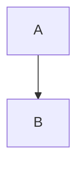
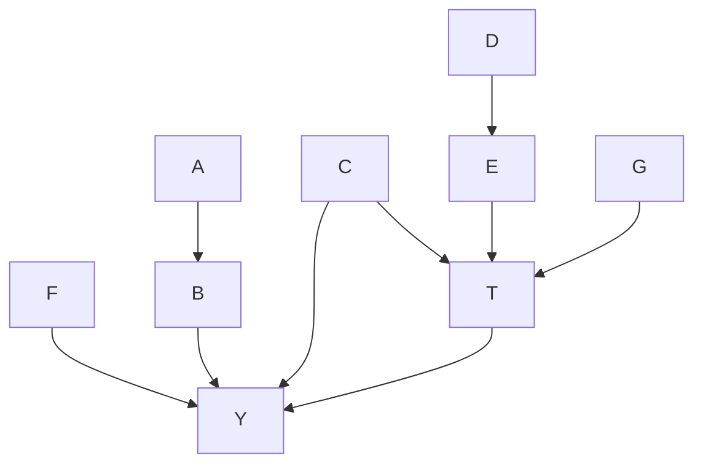

# Vector Institute Lab - Causal Inference via Machine Learning
# Shared Learning

## Terminology

Causality: an ordered link between two occurrences, where a theory of an underlying mechanism defines the direction. 

    Note: The theory of an underlying mechanism is usually defined by domain knowledge for the problem at hand

Outcome (Y): an observable result from a process of interest

Treatment/Intervention (T): an observable variable of interest, which is usually studied as having a causal relationship to the Outcome 

Causal Relationship: specifies the causality between two nodes
    example: A -> B or "A causes B" or "A has a causal effect on B" or "A affects B" 

    Note: Causality is not observable, it is a concept. One way to frame it is in terms of Counter-factuals. If we knew that under one value of A, a particular value of B was expected, but that under a different value of A, the value of B is expected to be different. We can only observe one outcome from one scenario. The next-best thing is to statistically construct those parallel but comparable scenarios and estimate the difference.

Causal Graph: a generalized format for incorporating all the causal relationships relating to the Outcome of a process. This is a graphical representation of the theory yielded by domain knowledge.

    Note: Graph is directed (direction of causality) and acyclic (nothing affects any factors that affect itself) 
        A affects B 
        B affects the Outcome 
        A indirectly affects the Outcome
        F directly affects the Outcome 
        Treatment affects the Outcome 
        C affects the Outcome, and also the Treatment
        C could be labelled a Confounding factor 
        G also affects the Treatment 
        G indirectly affects the Outcome

Covariates (X): factors in the causal graph other than the Outcome and Treatment (example: A, B, C, D, E, F, G)

Treatment Effect: the difference attributed to a particular Treatment value when compared against the counterfactual Outcome from a different Treatment value  
    example: 1yr mortality risk of a patient following a new treatment T_1 compared to the counterfactual 1yr mortality risk if that patient was given the control treatment T_0 
        formally: causal effect of treatment = (Y_1) - (Y_0)

Causal Inference: the procedure of estimating a causal effect statistically/quantifiably. 

    Note: To most accurately/precisely/reliably estimate this effect size for the factor of interest (generally an identified Treatment/Intervention) to compare between different values, the goal is to exclude the noise/effects of the other non-interesting covariates. 
        Commonly phrased as: "Isolate" the Treatment Effect we are estimating by "controlling for" the other covariates 
        Expected Treatment Effect = E(Y_1|T_1,X) - E(Y_0|T_0,X) 
        Modelling E(Y|T,X) is a great task for ML to do empirically, especially if a large number of covariates, covariate-values, or treatment-values data points make it impractical to calculate that expectation directly

## Discussion

* From the above graph, we should obviously control for covariate F affecting Y when examining how T affects Y.  
* Similarly, it would be ideal to control for at least one of A and B. Depending on the model used, it may range from non-harmful to harmful to include both non-independent factors, but only one is required.  
* Since T is not just another covariate, we don't really want to throw it in the mix the same as all the others ... worst-case, a model with regularization might simply ignore it depending on noise from other sources. That would artificially estimate the effect to be non-existent, and we are starting with a justified assumption that T does affect the Outcome. 
The direct effect of C on Y should be controlled for. But C indirectly affects Y via T, and following the example of indirect effects from A & B, it may be advantageous to only include one ... but removing T defeats the exercise, and removing C certainly means a biased estimate of Y. This confounding may require a different approach, or at least a model type that is robust against these non-independent factors.  
The indirect effect of G on Y via T suggests it may not be necessary to include, since there isn't any debate about which to keep (T vs G). But if it is observable, and is stated to have an indirect effect on Y, maybe there is something useful that can be done with it.  
How about D and E? Include both? Neither? One, or the other? (The standard predictive modelling approach is to throw it all in there and pick a model that is robust to noise, avoiding this conflict entirely.) 

**Motivation for a suitable model architecture:**

In a Randomized Controlled Trial (RCT), the design intentionally makes it such that P(T|X) is balanced for each value of T, independent across all values of X. This is very convenient mathematically, and fully avoids hazards from awkward data (see Simpson's paradox). 

In observational data, we generally have no control over the data that was generated. If there was any element of self-selection (ie some values of X were more likely to receive a certain treatment value), the data will often systematically unbalance itself. This alone is enough to invite issues for some popular models. 
So for observational data from which we attempt to draw causal inferences, we need to generalize for this phenomenon before we aggregate the data for our estimate. 

## Formal Concepts for Causal Inference 

Under certain assumed circumstances, ML can be deployed to compute a meaningful causal effect estimate
Consider these in the context of how a valid causal design like Random Controlled Trials satisfies them

Consistency: 
* we can only observe one out of the multiple counterfactual outcomes for a given sample unit 
* our observation of the outcome is reliable/verifiable according to our ground truth/gold standard/etc
* if we could manipulate and observe parallel universes, this topic of statistics is fully obsolete 
* RCT would be unnecessary

Independent outcomes: 
* the observed outcome of a unit does not depend on observed outcomes from other units 
* RCT relies on this too

Exchangeability: 
* to estimate a treatment-induced difference in outcomes, we need to compare two outcomes from two different units receiving two different Treatments, as simulated counterfactual outcomes of the same scenario 
* we need a basis for why they are similar enough to act like counterfactuals; assume "they could have exchanged places and we would expect to observe the counterfactual outcomes" 
* Intuitively: Knowing the treatment assigned to the patient gives us no information about what the outcome looks like.
    * imagine an observational dataset examining the mortality rates of those who were prescribed nicotine patches, vs those who were prescribed regular excercise; are the cohorts exchangeable? 
* RCT trivializes this, because the different treatment groups could be randomly exchanged up-front

Positivity:
* this leads into another assumption to be made explicit; in order for a simulated counter-factual to be construacted from data, each treatment group must have a strictly-positive representation of an exchangeable unit from the other group P(T_i|X) > 0 for all i
* the most direct way to assert this is to pick a unit from one treatment group, and find another with the same X value in the compared treatment group
* if there is no corresponding unit to represent an X in one group, then that unit must be disregarded, which could eventually lead to wasting a notable portion of a diverse sample
* now, when estimating the expected treatment effect across multiple units with many discinct permutations of X in cohort_A and cohort_B so that this inference is somewhat applicable on a broader scale, it becomes inconvenient to find exact matches, and that approach brings a number of other practicality concerns (if X contains continuous covariates, the permutations of X become immediately impractical) 
* RCT again asserts this, by assigning a given representation of X to each treatment group (which unit in which group is still random)

Conditional Exchangeability:
* it is sufficient for causal inference to compare E(Y_i|T_i,X), E(Y_j|T_j,X) for treatment groups i,j so long as P(T_i|X) = P(T_j|X) holds, just like a Randomized Controlled Trial 
* still controlling for all non-treatment covariates, in order to isolate the effect 
* assuming the observational data has not balanced itself naturally, we could simply re-weight the data points, inversely proportional to the observed frequencies of each X (aka propensity-score matching) ... except this is prone to numerical instabilities, which get more likely with higher dimensionality of X 
* RCT doesn't have to consider this, due to satisfying the stronger assumption above

Questions that the Vector Institute workshop gave answers to: 

* Why not just throw ML at the task of modelling P(T|X), and use it to correct the ML model for E(Y|T,X)? Is there a template for doing this? 
    * debiased ML (or less creatively, double ML)
    * https://csc2541-2022.github.io/lectures/CSC2541_lecture7_dml.pdf 
* Has someone defined a convenient way to mash both logical components into one Neural Network training loop?
    * yes, several  
* Is this question actively being worked on at the bleeding-edge of ML model design?
    * yes, which is why only a (relatively) small corpus of work has filtered to the mainstream ML audiences so far 

## Technical Solutions 

Reminder of simple inverse-propensity weighting 
https://en.wikipedia.org/wiki/Inverse_probability_weighting#Inverse_Probability_Weighted_Estimator_(IPWE)

Treatment group 1 by X:
    40 Blue 
    5 Red 
Treatment group 2 by X: 
    20 Blue 
    35 Red 

Re-weight so that each X is equally represented between each treatment group
The most prevalent X in the overall sample is still more heavily weighted within each treatment group

Avg Treatment Effect: 
    Sum of Y_1_blue / (40/60)   [weight 1.5x]
    + Sum of Y_1_red / (5/40)  [weight 8x]
    vs 
    Sum of Y_1_blue / (20/60)   [weight 3x]
    + Sum of Y_1_red / (35/40)  [weight 1.1x] 

    / 13.6 [standardize the relative weighting when interpreting the result] 

